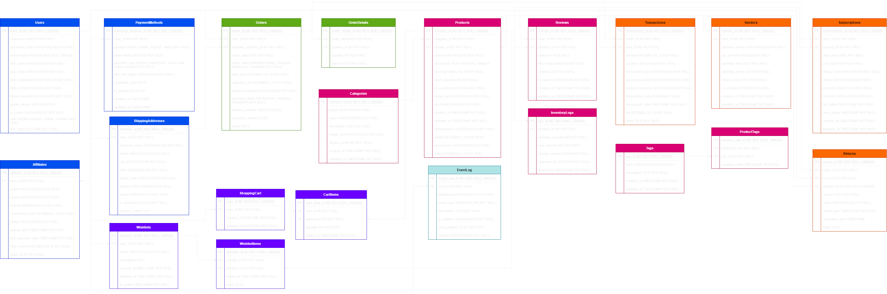

# Database design and philosophy

## Introduction
The database holds all user and product information, as well as clerical data (order history, activity, etc.) This project uses PostgreSQL.

## Setup
To set up the database locally,

## Schema
Here is a diagram of the database schema:

## Tables

### Users

**Purpose**:

This table represents a user of the website, grouping their relevant data into one place.

**Relationships**:

The user table references the Roles table to assign roles. 

**Columns**:

| Column Name             | Data Type             | Description                                |
| ----------------------- | :-------------------: | ------------------------------------------ |
| `user_id`               | PK INT                | Primary key for the user.                  |
| `role_id`               | FK INT                | Foreign key linking to the `Roles` table.  |
| `username`              | VARCHAR(50)           | Unique username chosen by the user.        |
| `password_hash`         | VARCHAR(512)          | Hashed version of the user's password.     |
| `password_salt`         | VARCHAR(512)          | Salt used in password hashing.             |
| `email`                 | VARCHAR(150)          | User's email address.                      |
| `email_verified`        | BOOL                  | If the user's email is verified.           |
| `verification_token`    | VARCHAR(255)          | Token for email verification.              |
| `first_name`            | VARCHAR(50)           | User's first name.                         |
| `last_name`             | VARCHAR(50)           | User's last name.                          |
| `date_registered`       | DATE                  | Date the user registered.                  |
| `date_of_birth`         | DATE                  | User's date of birth.                      |
| `phone_number`          | VARCHAR(20)           | User's contact number.                     |
| `profile_image`         | VARCHAR(500)          | Path to the user's profile image.          |
| `is_active`             | BOOL                  | If the user's account is active.           |
| `role`                  | ENUM                  | Role of the user (customer, admin, vendor) |
| `last_login`            | TIMESTAMP             | Date and time of the user's last login.    |
| `failed_login_attempts` | INT                   | Number of consecutive failed login attempts|
| `lockout_end_time`      | TIMESTAMP             | Lockout end time after failed logins.      |
| `password_reset_token`  | VARCHAR(255)          | Token for password reset.                  |
| `token_expiry`          | TIMESTAMP             | Expiry date of the reset token.            |
| `created_at`            | TIMESTAMP             | Account creation date and time.            |
| `updated_at`            | TIMESTAMP             | Account last update date and time.         |
| `preferred_language`    | VARCHAR(10), OPTIONAL | User's preferred language.                 |

### ShippingAdresses

**Purpose**:

This table represents the shipping address of a user.

**Relationships**:
* User - A single user can have many addresses, so the relationship is one User to many ShippingAdresses.

**Columns**:

| Column Name       | Data Type           | Description                                |
| ----------------- | :-----------------: | ------------------------------------------ |
| `address_id`      | PK INT              | Primary key for the address.               |
| `user_id`         | FK INT              | Foreign key linking to the `Users` table.  |
| `recipient_name`  | VARCHAR(100)        | Name of the recipient at this address.     |
| `street`          | VARCHAR(255)        | Street address.                            |
| `address_line_2`  | VARCHAR(255)        | Apartment, suite, unit, etc.               |
| `city`            | VARCHAR(100)        | City.                                      |
| `state`           | VARCHAR(100)        | State or province.                         |
| `postal_code`     | VARCHAR(20)         | Postal or ZIP code.                        |
| `country`         | VARCHAR(100)        | Country name.                              |
| `country_code`    | VARCHAR(3)          | Country code.                              |
| `phone_number`    | VARCHAR(20)         | Contact phone number for delivery queries. |
| `is_default`      | BOOL                | If the address is the default address.     |
| `address_type`    | VARCHAR(50)         | Type of address ("Home", "Work", etc.).    |
| `is_verified`     | BOOL                | Address verification status.               |
| `latitude`        | DECIMAL(9,6)        | Latitude of the address.                   |
| `longitude`       | DECIMAL(9,6)        | Longitude of the address.                  |
| `address_notes`   | TEXT                | Any additional delivery instructions.      |
| `created_at`      | TIMESTAMP           | Date and time the address was added.       |
| `updated_at`      | TIMESTAMP           | Date and time the address was last updated.|

### PaymentMethods

**Purpose**:

This table represents a user's method of payment.

**Relationships**:
* User - A single user can have many payment methods, so the relationship is one User to many PaymentMethods.

**Columns**:

| Column Name         | Data Type              | Description                                                       |
| ------------------- | :--------------------: | ----------------------------------------------------------------- |
| `payment_method_id` | PK INT                 | Primary key for the payment method.                               |
| `user_id`           | FK INT                 | Foreign key linking to the `Users` table.                         |
| `provider`          | ENUM(Provider)         | Payment provider (e.g., 'Stripe', 'PayPal', 'Bank').              |
| `token`             | ENCRYPTED VARCHAR(255) | Encrypted token returned by the payment gateway.                  |
| `payment_type`      | ENUM(PaymentType)      | Type of payment method ('Credit Card', 'Bank Account', etc.)      |
| `last_four_digits`  | VARCHAR(4)             | Last four digits of the card/account for reference.               |
| `card_type`         | VARCHAR(50)            | Type of card (e.g., 'Visa', 'MasterCard').                        |
| `name_on_card`      | VARCHAR(100)           | Name as it appears on the card.                                   |
| `billing_address_id`| FK INT (optional)      | Foreign key linking to a potential `BillingAddresses` table.      |
| `expiration_date`   | DATE (optional)        | Expiry date if applicable (e.g., for credit cards).               |
| `status`            | ENUM(Status)           | Status of the payment method ('Valid', 'Invalid', 'Expired').     |
| `is_default`        | BOOL                   | If this is the default payment method for the user.               |
| `created_at`        | TIMESTAMP              | Date and time when the payment method was added.                  |
| `updated_at`        | TIMESTAMP              | Date and time of the last update to the payment method.           |

### Orders

**Purpose**:

This table represents an order.

**Relationship**:
* User - A single user can have multiple Orders, so the relationship is one User to many Orders.
* ShippingAddresses - An order can only have one shipping address, so the relationship is one Order to one ShippingAdress.

**Columns**:

| Column Name           | Data Type           | Description                                                                  |
| --------------------- | :-----------------: | ---------------------------------------------------------------------------- |
| `order_id`            | PK INT              | Primary key for the order.                                                   |
| `user_id`             | FK INT              | Foreign key linking to the `Users` table.                                    |
| `shipping_address_id` | FK INT              | Foreign key linking to the `ShippingAddresses` table.                        |
| `payment_method_id`   | FK INT              | Foreign key linking to the `PaymentMethods` table.                           |
| `order_date`          | TIMESTAMP           | Date and time when the order was placed.                                     |
| `order_status`        | ENUM(OrderStatus)   | Status of the order (e.g., 'Pending', 'Shipped', 'Delivered', 'Cancelled').  |
| `total_price`         | DECIMAL(10, 2)      | Total price of the order, excluding tax and shipping.                        |
| `tax_amount`          | DECIMAL(7, 2)       | Tax amount applied to the order.                                             |
| `shipping_cost`       | DECIMAL(7, 2)       | Cost of shipping for the order.                                              |
| `discount_amount`     | DECIMAL(7, 2)       | Discount amount applied to the order, if any.                                |
| `payment_status`      | ENUM(PaymentStatus) | Status of the payment (e.g., 'Paid', 'Pending', 'Refunded').                 |
| `shipping_provider`   | VARCHAR(50)         | Shipping provider (e.g., 'UPS', 'FedEx').                                    |
| `tracking_number`     | VARCHAR(100)        | Shipping tracking number, if available.                                      |
| `expected_delivery`   | DATE                | Expected delivery date, if provided by the shipper.                          |
| `notes`               | TEXT                | Any additional notes or instructions related to the order.                   |

### ShoppingCart

**Purpose**:

This table represents a user's shopping cart.

**Relationship**:
* User - A single user can only have one ShoppingCart, so the relationship is one User to one ShoppingCart.

**Columns**:

| Column Name           | Data Type           | Description                                                                |
| --------------------- | :-----------------: | -------------------------------------------------------------------------- |
| `cart_id`             | PK INT              | Primary key for the shopping cart.                                         |
| `user_id`             | FK INT              | Foreign key linking to the `Users` table.                                  |
| `session_id`          | VARCHAR(255)        | Unique session identifier for non-logged-in users.                         |
| `status`              | ENUM(CartStatus)    | Status of the cart (e.g., 'Active', 'Abandoned', 'Converted to Order').    |
| `total_price`         | DECIMAL(10, 2)      | Total price of items in the cart.                                          |
| `discount_amount`     | DECIMAL(7, 2)       | Discount amount applied to the cart, if any.                               |
| `created_at`          | TIMESTAMP           | Date and time when the cart was created.                                   |
| `updated_at`          | TIMESTAMP           | Date and time of the last update to the cart.                              |

### CartItems

**Purpose**:

This table represents a user's shopping cart.

**Relationship**:
* Cart - A single cart item can only belong to a single cart, so the relationship is one CartItem to one ShoppingCart.
* Product - A single cart item represents a single product, so the relationship is one CartItem to one Product.

**Columns**:

| Column Name           | Data Type           | Description                                                                |
| --------------------- | :-----------------: | -------------------------------------------------------------------------- |
| `cart_item_id`        | PK INT              | Primary key for the cart item.                                             |
| `cart_id`             | FK INT              | Foreign key linking to the `ShoppingCart` table.                           |
| `product_id`          | FK INT              | Foreign key linking to the `Products` table.                               |
| `quantity`            | INT                 | Quantity of the product in the cart.                                       |
| `price_at_addition`   | DECIMAL(10, 2)      | Price of the product when added to the cart.                               |
| `discount_amount`     | DECIMAL(7, 2)       | Discount amount applied to this cart item, if any.                         |
| `added_at`            | TIMESTAMP           | Date and time when the item was added to the cart.                         |
| `updated_at`          | TIMESTAMP           | Date and time of the last update to the cart item.                         |

### Products

**Purpose**:

This table represents an item for sale.

**Relationship**:
* Category - A single product can only belong to a single category or subcategory, so the relationship is one Product to one Category.
* Vendor - A single can only belong to one vendor, so the relationship is one Product to one Vendor.

**Columns**:

| Column Name           | Data Type           | Description                                                                |
| --------------------- | :-----------------: | -------------------------------------------------------------------------- |
| `product_id`          | PK INT              | Primary key for the item.                                                  |
| `category_id`         | FK INT              | Foreign key linking to the `Category` table.                               |
| `vendor_id`           | FK INT              | Foreign key linking to the `Vendor` table.                                 |
| `name`                | VARCHAR(255)        | Name of the product.                                                       |
| `description`         | TEXT                | Detailed description of the product.                                       |
| `price`               | DECIMAL(10, 2)      | Price of the product.                                                      |
| `stock_quantity`      | INT                 | Quantity of the product in stock.                                          |
| `product_status`      | ENUM(StatusType)    | Status of the product (e.g., 'Available', 'Out of Stock').                 |
| `image_url`           | VARCHAR(255)        | URL to the product's main image.                                           |
| `sku`                 | VARCHAR(100)        | Stock Keeping Unit (SKU) or unique code for the product.                   |
| `created_at`          | TIMESTAMP           | Date and time when the product was added.                                  |
| `updated_at`          | TIMESTAMP           | Date and time of the last update to the product.                           |
| `manufacturer`        | VARCHAR(255)        | Manufacturer or brand of the product.                                      |
| `weight`              | DECIMAL(7, 2)       | Weight of the product.                                                     |
| `dimensions`          | VARCHAR(50)         | Dimensions of the product.                                                 |
| `rating`              | DECIMAL(3, 2)       | Average rating of the product.                                             |
| `safety_stock_level`  | INT                 | Minimum stock level before reordering.                                     |
| `meta_title`          | VARCHAR(255)        | SEO meta title for the product page.                                       |
| `meta_description`    | VARCHAR(255)        | SEO meta description for the product page.                                 |
| `slug`                | VARCHAR(255)        | SEO-friendly URL slug for the product.                                     |

### Categories

**Purpose**:

This table represents the categories items can be grouped by.

**Relationship**:
* Categories: One category can be parented to another, representing subcategories.

**Columns**:

| Column Name            | Data Type             | Description                                                                                  |
| ---------------------- | :-------------------: | -------------------------------------------------------------------------------------------- |
| `category_id`          | SERIAL                | Primary key for the category.                                                                |
| `parent_id`            | FK INT                | Foreign key linking to the parent category.                                                  |
| `name`                 | VARCHAR(255)          | Name of the category.                                                                        |
| `slug`                 | VARCHAR(255)          | SEO-friendly version of the category name.                                                   |
| `description`          | TEXT                  | Description of the category.                                                                 |
| `meta_title`           | VARCHAR(255)          | SEO title for the category.                                                                  |
| `meta_description`     | TEXT                  | SEO description for the category.                                                            |
| `image_url`            | VARCHAR(255)          | URL to category image.                                                                       |
| `icon`                 | VARCHAR(255)          | URL to category icon.                                                                        |
| `alt_text`             | VARCHAR(255)          | Alternative text for the category image.                                                     |
| `display_order`        | DECIMAL(10,2)         | Ordering number for display.                                                                 |
| `level`                | INT                   | Depth level in the category hierarchy.                                                       |
| `is_active`            | BOOL                  | Whether the category is currently active.                                                    |
| `color_code`           | VARCHAR(7)            | Color associated with the category (e.g., "#FF5733").                                        |
| `featured_product_id`  | FK INT                | Foreign key to a product that's featured in this category.                                   |
| `created_at`           | TIMESTAMP             | Date and time when the category was created.                                                 |
| `updated_at`           | TIMESTAMP             | Date and time of the last update to the category.                                            |

### Reviews

**Purpose**:

This table represents the categories items can be grouped by.

**Columns**:

| Column Name           | Data Type             | Description                                                                 |
| ----------------------| :-------------------: | --------------------------------------------------------------------------- |
| `review_id`           | SERIAL                | Primary key for the review.                                                 |
| `product_id`          | FK INT (SERIAL)       | Foreign key linking to the `Products` table.                                |
| `user_id`             | FK INT (SERIAL)       | Foreign key linking to the `Users` table. Indicates who wrote the review.   |
| `rating`              | INT                   | Rating given by the user (e.g., 1 to 5).                                    |
| `title`               | VARCHAR(255)          | Short title or summary of the review.                                       |
| `content`             | TEXT                  | Detailed review content.                                                    |
| `review_status`       | ENUM                  | Review status ('Pending', 'Approved', 'Rejected').                          |
| `helpful_count`       | INT                   | Number of times the review was marked as helpful.                           |
| `not_helpful_count`   | INT                   | Number of times the review was marked as not helpful.                       |
| `vendor_reply`        | TEXT                  | Reply from the vendor or admin to the review.                               |
| `is_visible`          | BOOLEAN               | A flag indicating if the reviewer wants the review to be visible to others. |
| `created_at`          | TIMESTAMP             | Date and time when the review was created.                                  |
| `updated_at`          | TIMESTAMP             | Date and time of the last update to the review.                             |

### InventoryLogs

**Purpose**:

This table represents a log of all changes to the site's inventory.

**Relationship**:
* Product: One category can be parented to another, representing subcategories.

**Columns**:

| Column Name           | Data Type             | Description                                                                                  |
| --------------------- | :-------------------: | -------------------------------------------------------------------------------------------- |
| `log_id`              | PK INT                | Primary key for the log entry.                                                               |
| `product_id`          | FK INT                | Foreign key linking to the `Products` table.                                                 |
| `previous_quantity`   | INT                   | Quantity before the change. Zero if a new item is added.                                     |
| `new_quantity`        | INT                   | Quantity after the change.                                                                   |
| `change_reason`       | ENUM(InvChangeReason) | Reason for the change (e.g., 'Sale', 'Stock Replenishment', 'Adjustment').                   |
| `changed_by`          | VARCHAR               | ID or name of the user/system that made the change.                                          |
| `timestamp`           | TIMESTAMP             | Date and time of the change.                                                                 |

### Vendors

**Purpose**:

This table represents a vendor who sells items on the site.

**Relationship**:
* User: One Vendor can only have one user account, so the relationship is one Vendor to one User.

**Columns**:

| Column Name           | Data Type              | Description                                                      |
| --------------------- | :--------------------: | ---------------------------------------------------------------- |
| `vendor_id`           | PK INT                 | Primary key for the vendor.                                      |
| `user_id`             | FK INT                 | Foreign key linking to the `Users` table.                        |
| `business_name`       | VARCHAR(255)           | The registered business name of the vendor.                      |
| `tax_id`              | VARCHAR(50)            | Tax identification number for the vendor.                        |
| `business_email`      | VARCHAR(100)           | Business contact email for the vendor.                           |
| `business_phone`      | VARCHAR(15)            | Business contact phone number for the vendor.                    |
| `shipping_policy`     | TEXT                   | Vendor's shipping policy details.                                |
| `return_policy`       | TEXT                   | Vendor's return policy details.                                  |
| `status`              | ENUM(VendorStatus)     | Status of the vendor (e.g., 'Pending', 'Verified', 'Suspended'). |
| `average_rating`      | DECIMAL(3, 2)          | Average rating or performance score for the vendor.              |
| `created_at`          | TIMESTAMP              | Date and time when the vendor was added.                         |
| `updated_at`          | TIMESTAMP              | Date and time of the last update to the vendor details.          |
| `verification_date`   | DATE (optional)        | Date when the vendor was verified.                               |
| `verified_by`         | VARCHAR(50) (optional) | ID or name of the user/system that verified the vendor.          |

### VendorPaymentMethods

**Purpose**:

Holds the payment options for Vendors.

**Relationship**:

* Vendor: One Vendor can have multiple payment methods, so the relationship is one Vendor to many VendorPaymentMethods.

**Columns**:

| Column Name              | Data Type           | Description                                                           |
| ------------------------ | :-----------------: | --------------------------------------------------------------------- |
| `payment_id`             | PK INT              | Primary key for the payment record.                                   |
| `vendor_id`              | FK INT              | Foreign key linking to the `Vendors` table.                           |
| `payment_method`         | ENUM(PaymentMethod) | Method of payment (e.g., 'Bank Transfer', 'PayPal', 'Check').         |
| `bank_name`              | VARCHAR(100)        | Name of the bank (if applicable).                                     |
| `account_name`           | VARCHAR(255)        | Account holder's name (might be different from business name).        |
| `account_number`         | VARCHAR(50)         | Bank account number or equivalent (should be encrypted).              |
| `swift_code`             | VARCHAR(50)         | SWIFT code for international transfers (if applicable).               |
| `routing_number`         | VARCHAR(50)         | Routing number for certain bank transfers (if applicable).            |
| `paypal_email`           | VARCHAR(100)        | Email associated with the PayPal account (if applicable).             |
| `is_default`             | BOOL                | Flag indicating if this is the default payment method for the vendor. |
| `created_at`             | TIMESTAMP           | Date and time when the payment method was added.                      |
| `updated_at`             | TIMESTAMP           | Date and time of the last update to the payment method details.       |

### Transactions

**Purpose**:

This table represents financial transactions.

**Relationship**:
* Order: One Order can only have one Transaction, so the relationship is one Order to one Transaction.
* User: One User can have multiple Transactions, so the relationship is one User to many Transactions.

**Columns**:

| Column Name           | Data Type               | Description                                                                       |
| --------------------- | :---------------------: | --------------------------------------------------------------------------------- |
| `transaction_id`      | PK INT                  | Primary key for the transaction.                                                  |
| `order_id`            | FK INT                  | Foreign key linking to the Orders table. Provides context for the transaction.    |
| `user_id`             | FK INT                  | Foreign key linking to the Users table. Which user the transaction relates to.    |
| `amount`              | DECIMAL(10, 2)          | The amount of the transaction.                                                    |
| `currency`            | VARCHAR(5)              | Currency code for the transaction (e.g., USD, EUR).                               |
| `transaction_type`    | ENUM(TransactionType)   | Type of transaction (e.g., 'Sale', 'Refund', 'Chargeback').                       |
| `payment_method`      | ENUM(PaymentMethod)     | Method used for the transaction (e.g., 'Credit Card', 'PayPal', 'Bank Transfer'). |
| `payment_gateway`     | VARCHAR(50)             | The payment gateway or service used (e.g., 'Stripe', 'Square').                   |
| `transaction_status`  | ENUM(TransactionStatus) | Status of the transaction (e.g., 'Completed', 'Pending', 'Failed').               |
| `transaction_date`    | TIMESTAMP               | Date and time when the transaction took place.                                    |
| `fee`                 | DECIMAL(10, 2)          | Any fee associated with the transaction (e.g., processing fee).                   |
| `notes`               | TEXT                    | Optional notes or additional information about the transaction.                   |

### Tags

**Purpose**:

This table represents product tags used to filter and locate items.

**Columns**:

| Column Name           | Data Type                  | Description                                                      |
| --------------------- | :------------------------: | ---------------------------------------------------------------- |
| `tag_id`              | PK INT                     | Primary key for the tag.                                         |
| `name`                | VARCHAR(255)               | The name or label of the tag (e.g., "Summer", "Exclusive").      |
| `description`         | TEXT                       | A brief description or context about the tag (optional).         |
| `type`                | VARCHAR(100)               | The type or category of the tag (e.g., 'Season', 'Promotion').   |
| `icon_url`            | VARCHAR(255)               | URL to an icon or image representing the tag (optional).         |
| `color`               | VARCHAR(7)                 | HEX color code for the tag (optional).                           |
| `status`              | ENUM('Active', 'Inactive') | Status of the tag, indicating if it's currently in use or not.   |
| `usage_count`         | INT                        | Counter to track the number of times the tag is used (optional). |
| `created_at`          | TIMESTAMP                  | Date and time when the tag was created.                          |
| `updated_at`          | TIMESTAMP                  | Date and time of the last update to the tag.                     |

### ProductTags

**Purpose**:

This table represents tags assigned to individual products.

**Relationship**:
* Product: One ProductTag can have multiple Products, so the relationship is one ProductTag to many Products.

**Columns**:

| Column Name       | Data Type           | Description                                                             |
| ----------------- | :-----------------: | ----------------------------------------------------------------------- |
| `product_tag_id`  | PK INT              | Primary key for the product-tag association.                            |
| `product_id`      | FK INT              | Foreign key linking to the Products table.                              |
| `tag_id`          | FK INT              | Foreign key linking to the Tags table.                                  |
| `assigned_by`     | FK INT (optional)   | Foreign key linking to the Users table (who assigned the tag).          |
| `assigned_date`   | TIMESTAMP           | Date and time when the tag was assigned to the product.                 |
| `removed_date`    | TIMESTAMP (optional)| Date and time when the tag was removed from the product.                |
| `is_active`       | BOOL                | Indicates if the tag is currently active on the product.                |

### Subscriptions

**Purpose**:

This table represents subscriptions.

**Relationship**:
* User: One User can have multiple Subscriptions, so the relationship is one User to many Subscriptions.
* Product: The Subscription is bound to a single Product, so the relationship is one Product to one Subscription.

**Columns**:

| Column Name           | Data Type                | Description                                                                                 |
| --------------------- | :----------------------: | ------------------------------------------------------------------------------------------- |
| `subscription_id`     | PK INT                   | Primary key for the subscription.                                                           |
| `user_id`             | FK INT                   | Foreign key linking to the Users table. Indicates the user who has the subscription.        |
| `product_id`          | FK INT                   | Foreign key linking to the Products table. The subscription is tied to a specific product.  |
| `payment_method_id`   | FK INT                   | Foreign key linking to the PaymentMethods table. Payment method used for this subscription. |
| `start_date`          | DATE                     | The start date of the subscription.                                                         |
| `end_date`            | DATE                     | The end date of the subscription. It can be NULL for open-ended subscriptions.              |
| `billing_cycle`       | Enum(BillingCycle)       | How often the user is billed (e.g., 'Monthly', 'Annually').                                 |
| `status`              | Enum(SubscriptionStatus) | Current status of the subscription (e.g., 'Active', 'Paused', 'Cancelled', 'Expired').      |
| `price`               | DECIMAL(10, 2)           | Price of the subscription for each billing cycle.                                           |
| `currency`            | VARCHAR(5)               | Currency code for the subscription price (e.g., USD, EUR).                                  |
| `last_billed`         | TIMESTAMP                | Date and time of the last billing event.                                                    |
| `next_billing`        | TIMESTAMP                | Date and time of the next scheduled billing event.                                          |
| `tier_or_level`       | VARCHAR(50)              | The tier or level of the subscription, if applicable (e.g., 'Basic', 'Premium').            |
| `discount_code`       | VARCHAR(50) (optional)   | The discount or promotional code used when starting the subscription, if any.               |
| `auto_renewal`        | BOOL                     | Indicates if the subscription will auto-renew.                                              |
| `cancellation_reason` | TEXT (optional)          | Reason provided by the user for cancelling the subscription, if they did.                   |
| `created_at`          | TIMESTAMP                | Date and time when the subscription was created.                                            |
| `updated_at`          | TIMESTAMP                | Date and time of the last update to the subscription.                                       |

### Returns

**Purpose**:

This table represents product returns.

**Relationship**:
* Order: One Order can have multiple Returns, so the relationship is one Order to many Returns.
* User: One User can have multiple Returns, so the relationship is one User to many Returns.
* Product: One Product can only be Returned once, so the relationship is one Product to one Return.

**Columns**:

| Column Name           | Data Type                 | Description                                                                         |
| --------------------- | :-----------------------: | ----------------------------------------------------------------------------------- |
| `return_id`           | PK INT                    | Primary key for the return.                                                         |
| `order_id`            | FK INT                    | Foreign key linking to the Orders table. The Order being returned.                  |
| `user_id`             | FK INT                    | Foreign key linking to the Users table. Indicates the user initiating the return.   |
| `product_id`          | FK INT                    | Foreign key linking to the Products table. The specific product being returned.     |
| `return_quantity`     | INT                       | The quantity of the product being returned.                                         |
| `reason`              | TEXT                      | Reason provided by the customer for the return.                                     |
| `status`              | ENUM(ReturnStatus)        | Current status of the return (e.g., 'Pending', 'Accepted',..)                       |
| `return_date`         | TIMESTAMP                 | Date and time when the return was initiated.                                        |
| `resolution_date`     | TIMESTAMP                 | Date and time when the return was resolved (refunded, exchanged, etc.).             |
| `refund_amount`       | DECIMAL(10, 2) (optional) | Amount refunded to the customer, if applicable.                                     |
| `resolution_notes`    | TEXT (optional)           | Notes or comments from the support or operations team about the resolution process. |
| `processed_by`        | VARCHAR(100) (optional)   | ID or name of the user/system that processed the return.                            |
| `payment_method`      | ENUM(PaymentMethod)       | The payment method used for the original order, helpful for processing refunds.     |
| `notes`               | TEXT (optional)           | Any additional notes or details about the return.                                   |

### Affiliates

**Purpose**:

This table represents Affiliate users.

**Relationship**:
* User: One User represents one Affiliate, so the relationship is one User to one Affiliate.

**Columns**:

| Column Name           | Data Type             | Description                                                                |
| --------------------- | :-------------------: | -------------------------------------------------------------------------- |
| `affiliate_id`        | PK INT                | Primary key for the affiliate.                                             |
| `user_id`             | FK INT                | Foreign key linking to the Users table. The associated user account.       |
| `name`                | VARCHAR(255)          | The name or label of the affiliate.                                        |
| `email`               | VARCHAR(255)          | Contact email for the affiliate.                                           |
| `website`             | VARCHAR(255)          | The website or platform where the affiliate promotes products.             |
| `referral_code`       | VARCHAR(100)          | Unique referral code or identifier used by the affiliate.                  |
| `commission_rate`     | DECIMAL(5, 2)         | Percentage rate for the affiliate's commission.                            |
| `status`              | Enum(AffiliateStatus) | Status of the affiliate (e.g., 'Active', 'Suspended', 'Pending Approval'). |
| `signup_date`         | TIMESTAMP             | Date and time when the affiliate joined the program.                       |
| `last_payment_date`   | TIMESTAMP             | Date and time of the last commission payment to the affiliate.             |
| `payment_details`     | TEXT                  | Preferred payment method or details for the affiliate (stored securely).   |
| `payment_threshold`   | DECIMAL(10, 2)        | Minimum amount required in earnings before a payment is issued.            |
| `current_balance`     | DECIMAL(10, 2)        | Current outstanding commission balance for the affiliate.                  |
| `total_earned`        | DECIMAL(10, 2)        | Total commission earned by the affiliate to date.                          |
| `notes`               | TEXT                  | Any additional notes or details about the affiliate.                       |

### EventLogs

**Purpose**:

This table represents a log of site-wide events, such as a user signing up.

**Relationship**:
* User: One Event can represent one User action, so the relationship is one User to one Event.

**Columns**:

| Column Name           | Data Type           | Description                                                                          |
| --------------------- | :-----------------: | ------------------------------------------------------------------------------------ |
| `event_log_id`        | PK INT              | Primary key for the log entry.                                                       |
| `user_id`             | FK INT              | Foreign key linking to the Users table. The user associated with the event (if any). |
| `timestamp`           | TIMESTAMP           | Date and time when the event occurred.                                               |
| `event_type`          | ENUM(EventType)     | Type or category of the event.                                                       |
| `event_action`        | ENUM(EventAction)   | Specific action associated with the event.                                           |
| `event_source`        | ENUM(EventSource)   | Source of the event.                                                                 |
| `description`         | TEXT                | Detailed description of the event or any messages associated with it.                |
| `contextual_data`     | JSONB               | Contextual data related to the event in a structured format (optional).              |
| `ip_address`          | VARCHAR(50)         | IP address from where the event was initiated.                                       |
| `geo_location`        | VARCHAR(255)        | Geolocation information derived from the IP address (optional).                      |
| `user_agent`          | TEXT                | Information about the user's browser, OS, and device.                                |
| `severity`            | ENUM(EventSeverity) | Indicates the severity or importance of the event.                                   |

### Partnerships

**Purpose**:

This table represents a business partnership.

**Columns**:

| Column Name           | Data Type             | Description                                                          |
| --------------------- | :-------------------: | -------------------------------------------------------------------- |
| `partnership_id`      | PK INT                | Primary key for the partnership.                                     |
| `partner_name`        | VARCHAR(255)          | The name of the partner organization.                                |
| `contact_person`      | VARCHAR(255)          | The name of the point of contact.                                    |
| `contact_position`    | VARCHAR(100)          | Job title or position of the contact person.                         |
| `contact_email`       | VARCHAR(255)          | The email of the point of contact.                                   |
| `contact_phone`       | VARCHAR(20)           | Contact phone number of the point of contact.                        |
| `partnership_type`    | ENUM(PartnershipType) | Type of partnership (Collaboration, Integration, Sponsorship, etc.). |
| `start_date`          | DATE                  | The date that the partnership started.                               |
| `end_date`            | DATE                  | The date that the partnership ended (if applicable).                 |
| `terms`               | TEXT                  | The terms of the partnership.                                        |
| `benefits`            | TEXT                  | Benefits of the partnership.                                         |
| `agreement_document`  | VARCHAR(255)          | Path or link to the digital partnership agreement document.          |
| `is_active`           | BOOL                  | If the partnership is currently active.                              |
| `renewal_date`        | DATE                  | Date when the partnership is up for renewal (if applicable).         |
| `metrics`             | JSONB(optional)       | Metrics related to the partnership.                                  |
| `created_at`          | TIMESTAMP             | Date and time when the partnership record was created.               |
| `updated_at`          | TIMESTAMP             | Date and time of the last update to the partnership record.          |

### Roles

**Purpose**:

This table holds possible roles a user can be assigned. A table was chosen over an Enum to allow future growth and flexibility.

**Columns**:

| Role ID | Role Name   | Description                                                                                                       |
| ------- | ----------- | ----------------------------------------------------------------------------------------------------------------- |
| 1       | Customer    | Regular shoppers on the platform. They can browse, add items to cart, make purchases, and leave reviews.          |
| 2       | Admin       | Platform administrators. They have the highest level of access, including user management, product listing, etc.  |
| 3       | Vendor      | Sellers or suppliers on the platform. They can list their products, manage inventory, and fulfill orders.         |
| 4       | Affiliate   | Partners who promote products on their platforms and earn a commission for each sale made through their referral. |
| 5       | Partner     | Strategic partners who collaborate with the e-commerce platform for various initiatives or joint ventures.        |

## Enums

* `PaymentProvider`
    * Stripe
    * PayPal
    * Bank

 

* `PaymentType`
    * Credit Card
    * Debit Card
    * Bank Account

 

* `OrderStatus`
    * Pending
    * Shipped
    * Delivered
    * Cancelled

 

* `PaymentMethod`
    * Credit Card
    * Debit Card
    * PayPal

 

* `PaymentStatus`
    * Paid
    * Pending
    * Refunded

 

* `InvChangeReason`
    * Sale
    * Stock Replenishment
    * Adjustment

 

* `TransactionType`
    * Sale
    * Refund
    * Chargeback

 

* `PaymentGateway`
    * Stripe
    * Square

 

* `TransactionStatus`
    * Completed
    * Pending
    * Failed

 

* `BillingCycle`
    * Daily
    * Weekly
    * Monthly
    * Annually
    * Bi-Annually

 

* `SubscriptionStatus`
    * Active
    * Paused
    * Cancelled
    * Expired

 

* `ReturnStatus`
    * Pending
    * Accepted
    * Rejected
    * Refunded
    * Exchanged

 

* `AffiliateStatus`
    * Active
    * Suspended
    * Pending Approval

 

* `EventSeverity`
    * Info
    * Warning
    * Error
    * Critical

 

* `EventType`
    * Login
    * Purchase
    * Error
    * System Update

 

* `EventAction`
    * Create
    * Update
    * Delete

 

* `EventSource`
    * Web
    * Mobile App
    * API
    * System

 

* `PartnershipType`
    * Collaboration
    * Integration
    * Sponsorship
    * Affiliation
    * Dropshipping
    * Wholesale
    * Brand Ambassador

 

## Conventions
* Naming conventions:
    - Table names use PascalCase
    - Column names use snake_case

## Views, Stored Procedures, and Functions:
Database views used:

## Backup and Restore Procedures

To backup: `DatabaseBackupAndRestore.exe` backup
To restore: `DatabaseBackupAndRestore.exe` restore `path\to\backup\file.sql`

## Performance Optimizations

## Change Log
